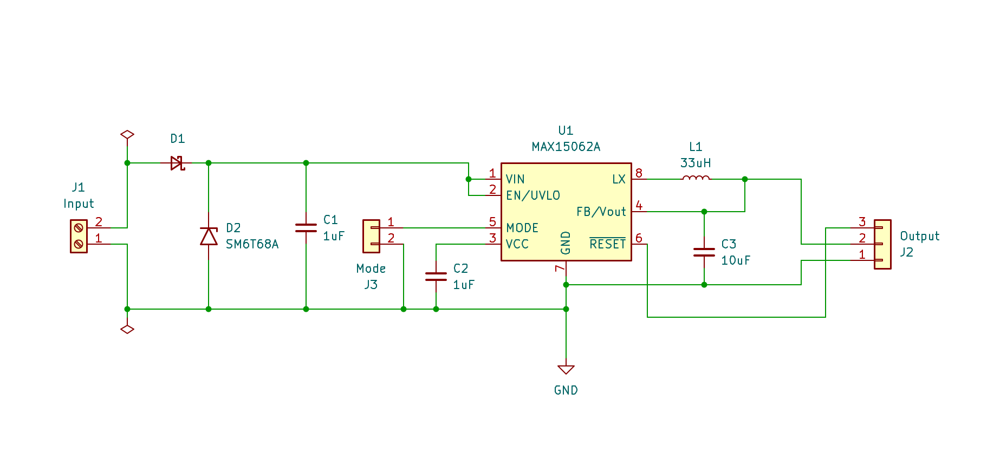
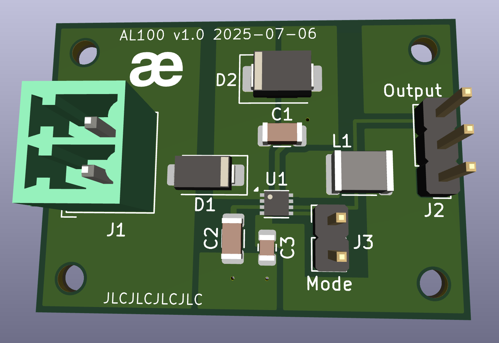
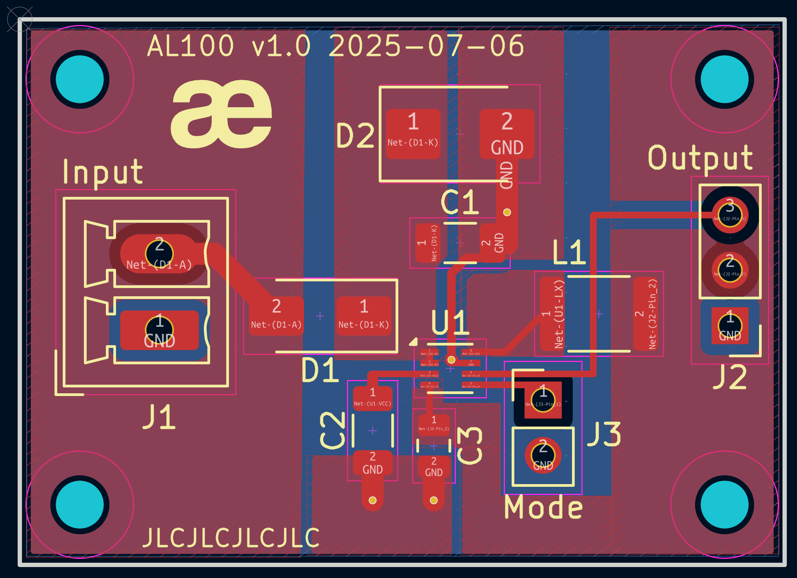

MAX15062 Breakout
=================

This KiCad project provides an open-source breakout board for the [MAX15062](https://www.analog.com/en/products/max15062.html) high-efficiency, high-voltage, synchronous step-down DC-DC converter IC. The board is designed to deliver up to **300mA at 3.3V** from input voltages as high as 60V.

Schematic 
---------

PCB Layout
----------

KiCad Version
-------------

Created with **KiCad 9.0.1**

License
-------

This project is licensed under the [MIT License](LICENSE.md).
